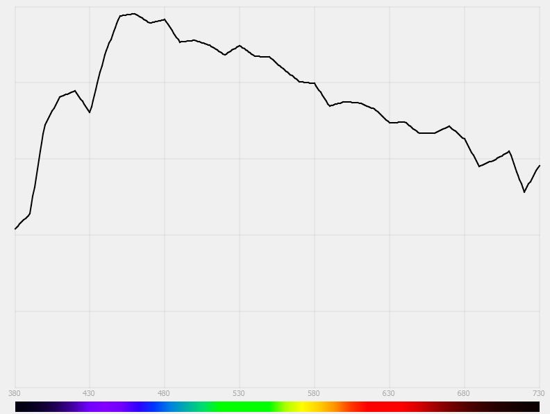
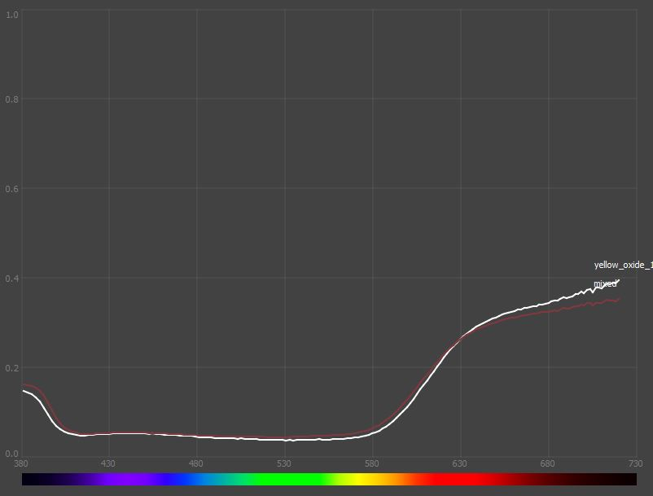
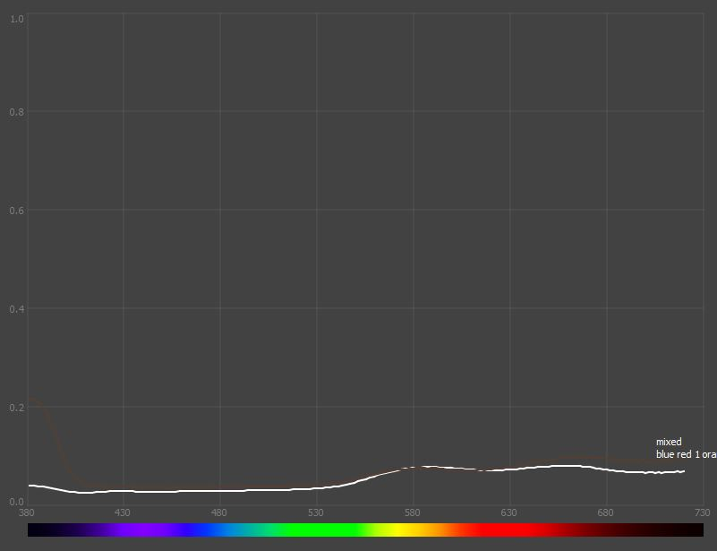
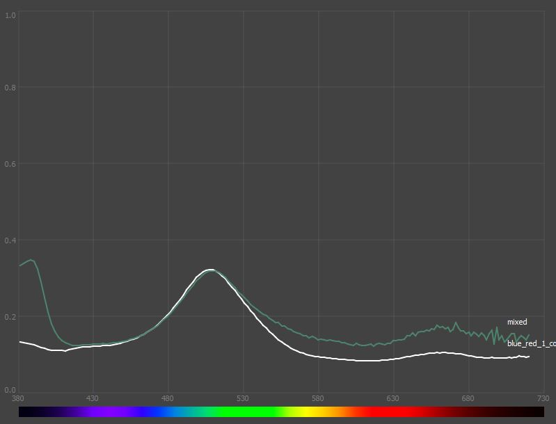
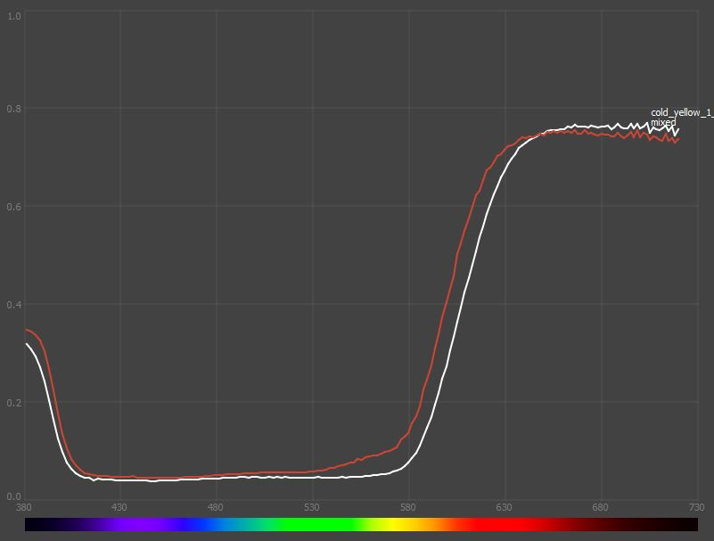

On Light, Colors, Mixing Paints, and Numerical Optimization.
-----------------------

This is a short write-up that is supposed to serve as a rough description of what's going on in the paint mixing tool in this depot.

The tool is a virtual paint mixing tool and a solver that can generate recipes for creating a particular color out of existing paints. The tool comes with data for Kimera paints that I measured. The tool is a Python 3 program; it comes with all the sources, and if you have a Python distribution, you can just run it. There's also a Windows executable created with PyInstaller (see 'Releases', on the right). I can probably create a MacOS version too, if need be.

If you just want to grab the tool and play with it, that's about it! Have fun, and I hope you find it at least somewhat useful.

But below, you'll find a more or less complete description of how it works (and when it doesn't). So, if you have a bit of time to spare, read on!

Introduction
------------

Very recently, I discovered miniature painting. I was never really into WH40K or anything related, but I have some fond memories of playing pen & paper RPGs years ago, and after watching a bunch of YouTube videos, I thought it looked easy enough to try. I still suck at it, but I somehow really enjoy the tranquilizing experience of putting thin layers of paint onto 3 cm tall figurines.

  

In my day job, I do real-time graphics engineering for video games, and it quickly turned out that a lot of the problems I deal with at work are very similar to those in miniature painting: you analyze how light behaves, how it interacts with different surfaces, how the eyes perceive it, etc. Of course, painting is not just engineering; it's *Art* after all (capital 'A'), but there seems to be a consensus that painters should understand these technical aspects, even just to know when they deliberately break them.

There were a number of things that looked like fascinating research projects somewhere between miniatures and computer graphics, but one thing that sparked my particular interest was paints. Miniature paints usually come with these cryptic names: Skrag Brown, Tombstone Horror, or whatever. I don't really mind, but the producers never actually tell you what these colors actually are. And when you have limited experience, it's often hard to tell if a particular paint will work as some midtone or if it will be too dark. Many YouTube tutorial videos actually tell you which exact paints they use, but they most often come from different lines, some are immediately available, some are not, and for some, you need to wait - and I want to paint this very second! It seemed pretty clear that instead of buying all the possible paints, the more reasonable approach would be to pick some base paints and learn to mix them to get the colors that I need.

For a beginner, there are, however, two problems. First: mixing paint is not a particularly intuitive process: sometimes you get something reasonable, sometimes you get muddy brown. Second: you need to know what color you actually want to get. Sure, there are some nice videos on how to color match, but if you don't have a good intuition of what skin tone you want to achieve, it's hard to tell if your mix needs more blue or red.

Because of my engineering background, the solution seemed obvious: I would like to just pick a color on the screen (from, say, a photograph) and I want to know which paints, and how much of them, to mix to get it. I would also like to experiment with mixing paints without actually having to waste physical paint. For that, I need to somehow characterize the paints that I have, I need a model for simulating how they mix, and I need a numerical solver that will be able to minimize the error between the color that I want and a mix of some number of paints. These sorts of processes are something that I regularly go through and enjoy, so it looked like a perfect on-the-side project.

Disclaimer here: yes, I know that in practice no one works that way. Especially if the solver gives you ratios like 88 parts of white, 3 parts of blue, and 2 parts of yellow - there's no way to mix something like this on a wet palette where you work with a minuscule amount of paint. But, at least to me, it's still useful to know that it's mostly white, with a touch of blue and yellow, so when I mix something on the palette, I'm not doing it completely blind. And yes, if you've been painting for some time, you learn these things, you get that intuition. But you need to get it somehow. Painting takes a lot of practice, so if I can do some experiments purely digitally, I'm totally up for it. And to be honest, it's all more of a cool side project rather than anything else.

Just in case anyone else finds it useful, I thought I'll write up all the theoretical basis for a simple tool I developed for this and provide it together with a simple Python code. Since I just had a bit of free time (I got COVID), and I just got my set of Kimera paints (which are single pigment, so incredibly saturated colors, amazing for mixing), I spent a week on this, and you can read about the results here. As it might be read by people with a less technical background, I'm trying to keep it all pretty simple and self-contained, so all the information you need to understand it is here. I'm not sure how that worked out in the end, but if something is unclear, feel free to ping me and ask for details. None of it is actually any rocket science; it's mostly some high-school level math and physics (but if you're allergic, a warning: there is some math in there).

So if you're curious about how it all works, details below.

Light
---------
Light is an electromagnetic wave, oscillations of electrical and magnetic fields propagating in space. Human eyes are sensitive to wavelengths between roughly 400 and 700 nanometers, which we perceive as colors, from violet, through blue, green, yellow, orange, to red.

  

Light that usually reaches our eyes is a mixture of many different wavelengths. Depending on the ratios between the amounts of particular wavelengths, we perceive the light as different colors. If it consists mostly of the shorter visible wavelengths, we'll see it as blue. If it's mostly longer wavelengths, it's going to be red. The more precise details are further down, but that's the general intuition.

To reason about these characteristics in a more principled way, one useful tool is a so-called spectral power distribution (SPD for short). It's a function that, roughly speaking, describes how much of a particular wavelength is present in some radiation. It is usually plotted as a graph, with wavelength on the horizontal axis and some energy-related quantity on the vertical axis (so the stronger a particular wavelength is, the higher the plot).

So the "generally blue" light might have an SPD like this:

  

and the "generally red" light might have it more like this:

  

One particularly interesting family of SPDs are those of different light sources. You can take any light source and measure how much of the light it produces comes from particular wavelengths. There's this thing in physics called black body radiation that describes the SPD of a perfectly black body (so that it doesn't reflect any light, just generates it) heated to a particular temperature (all that actually led straight to quantum mechanics and the world we know today; actually analyzing spectra of starlight led to the understanding that the distant stars produce energy just like the sun, the lines appearing in the spectra of excited gases was another catalyst in the evolution of quantum mechanics, and shift in the spectra of the light from different galaxies led to the discovery that the universe is expanding; it's all in the spectrum). If you've ever come across these "2700K light", "5000K light" markings, they are exactly that - they describe the light color as the color of a black body radiator of a given temperature, in Kelvin.

The SPD of a typical ~2800K incandescent light looks like this:

  

and a ~4200K fluorescent light looks like this.

  

The SPD of what we consider sunlight is a fairly complex distribution that includes not only the actual SPD of the light generated by the sun but also the absorption and scattering of some of it occurring when the light passes through the atmosphere. Because the sunlight encounters different amounts of atmosphere on its way at different times of the day (less at noon, more in the evening), the sunlight SPD also depends on the time of day and atmospheric conditions. On a typical sunny day, it might look like this:

  

Because we're doing science here, everything needs to be standardized, measured, and quantified. For that reason, the CIE (International Commission on Illumination) introduced "standard illuminants" - a number of SPDs describing some very particular lights. Illuminant A represents a typical tungsten filament light bulb, a black-body radiator at 2856K. Illuminants B and C have become pretty much obsolete in favor of Illuminants D. There's a whole family of these; they describe daylight in different conditions - from more "warm" ones (D50, D55) to colder ones (D65, D70). The numbers 50/55/65/70 roughly correspond to a black-body temperature that would emit light of similar color (5000K, 5500K, 6500K, 7000K), but it's a longer topic and not particularly relevant here. There are also other illuminants (like E and F), but in most practical situations, the interesting ones are A, D50, and D65 (especially the last one).

One last thing that seems fairly obvious, but is very important later on: light behavior is linear (in mathematical terms). If you take two lights with two SPDs and you turn them on at the same time, the resulting lighting will have an SPD that's the sum of the two components. If you make the light twice as bright, the resulting SPD will be two times greater.

Reflection
------------

We rarely see light as it is generated by some source. Before it reaches our eyes, it usually bounces off things, and we register that indirect, reflected light.

The way light interacts with surfaces is an incredibly complicated topic. The most basic principle is fairly simple and described by Fresnel's equations: light reaches the boundary between two mediums (say, air and an object) and some of it gets reflected off the boundary, and some of it gets refracted into the object. The angle between the reflected light and the normal to the surface (which is a direction perpendicular to the surface) is the same as the angle between the incident light and the normal (alpha on the figure below). How much of the light goes where, and the exact direction of the refracted light, depends on the index of refraction of both mediums (which describes how fast light travels in that particular medium compared to its speed in vacuum).

  

Unfortunately, this only describes reflection off a perfectly smooth, mirror surface - nothing like anything you see in reality. And it only describes the first reflection off a boundary. But light can bounce around off the microscopic roughnesses of the surface and go into the object in a different place. Or it can do it multiple times. Or it can go into the object, bounce around there, and go out (or not, there's a boundary when going outside to the air as well). And all this is ignoring any wave phenomena - diffraction, interference, etc.

  

Physics, optics, and related fields have tried to simplify all these concepts and created multiple models for describing and quantifying these effects. Some are simpler, some are very complex. Computer graphics loves them because they allow us to render realistic-looking images on a computer.

From the perspective of a miniature painter, the simplest way of looking at the light-material interaction is to split it into two components. I will call them "diffuse" and "specular" because these are the terms used in computer graphics, which I'm used to.

  

The "specular" component of the reflection is everything that happens on the actual boundary between the air and the object. Some of the light bounces off it. Generally, it follows the law of reflection, so the angle between the direction the light falls onto the object and the normal is the same as the angle between the direction the light is reflected at and the normal (the normal is the direction perpendicular to the surface). I say "generally" because if the surface is not perfectly smooth, the light will be scattered in different directions - the rougher the surface, the more scattered it will be - but generally, it will be around that reflected direction. One very important bit: in the case of non-metal materials, light reflected this way does not change its color. The reflected light will have the same SPD as the one falling on the object. Interestingly, this behavior is very similar for most non-metals. To the extent that in computer graphics, we often just treat all non-metal surfaces the same way: they can be rough or smooth, but they reflect the same amount of light: no matter if it's plastic, skin, or concrete. It's a very decent approximation. Metals, due to their atomic structure, are different. When the light reflects off their surface in a specular reflection, it actually changes color. That's why gold is yellow and copper is orange. 

  

The "diffuse" component is all the light that goes into the object and then some of it gets out and is, generally, scattered uniformly in all directions (or rather: let's just assume it for simplicity, that's a good enough approximation). It doesn't matter how the surface is viewed; its diffuse lighting is the same from all angles (unlike specular, which is strongly visible when viewed from that one particular direction, and not much when viewed from others). Not all the light that gets into the object gets scattered out. Some of it is absorbed and turned into heat. There's also an important difference between metals and non-metals when it comes to the diffuse component. For non-metals, the spectrum of the reflected light very much depends on the object: after all, the light goes into the surface, bounces around, and comes out - so it picks up some of the characteristics of the object. For metals, there's no diffuse component at all. The light doesn't go out; it's either absorbed or bounces off specularly. And even though, technically, the diffuse component is not "reflection", but rather a form of scattering occurring over short distances within the material, I will oftentimes just say "diffuse reflection" for simplicity.

  

Side note: even though it's safe to treat the diffuse reflection as the same in all directions, its brightness still depends on the amount of light *falling* onto the given part of the object. And this amount is related to the angle between the normal of the surface and the direction towards the light: the bigger the angle, the less light the given part of the object receives (actually, the amount of light is the same; it's just distributed over a larger area, which makes "light per area" smaller, and this is what we consider "brightness"). In physics, this is called Lambert's law. In many miniature painting tutorials, people talk about shading basic shapes in a particular way: spheres have round shading towards the light, cylinders have highlights along the axis, and cubes/surfaces have generally flat lighting, depending on their orientation. This is a practical application of Lambert's law. Spheres have smoothly changing normals in all possible directions, so their brightest area is going to be in sections facing the light. Normals of a cylinder change as you go around the circle but are the same as you move along the axis, so the entire length of the cylinder is shaded the same. Flat planes have a constant normal, so every point gets the same lighting.

  

(Side note to the side note: this is, of course, only true if we assume that the direction towards the light is the same on the entire surface! But is it? If we consider sunlight, the source is so far away that we can safely think that yes, every point gets the light from the same direction - it's a directional light. But for other sources, the position of the light matters too. And if the light is not a simple point but rather something larger, it all gets complicated even more).

For paints, we can focus on the diffuse component only. Miniature paints dry pretty matte, so the surface of the dried paint is pretty rough. The specular component of the reflection is very faint and does brighten the surface a bit with light color, but the main characteristics of the appearance come from the diffuse part. I'll go into some theories describing what is going on with light in the paint layer later on, but for now, we can look at the macroscopic effect: light with some particular SPD falls onto the paint layer, and some of it gets scattered uniformly in all directions, and some get absorbed. We can compute the ratio of that scattered light to the incident light. This is called reflectance and, just like SPD, is a spectral characteristic: objects reflect different wavelengths differently. Some wavelengths are reflected more, some are absorbed more. This is what determines the color of the object. If an object absorbs short wavelengths and reflects and scatters long ones, it will appear reddish. If it reflects short wavelengths and absorbs long ones, it will be bluish. This is, of course, assuming that the illumination is uniform in all wavelengths. If there are no long wavelengths in the incoming lighting and the object reflects only long wavelengths, it won't look red; it will look black, as it will not reflect any light. The actual light that we see reflected diffusely off the object is a product of the object's reflectance and the SPD of the incoming light:

  

  
  
  =
    
  *
       

Not surprisingly, the same object can look very differently depending on the light used for illumination. And you can reason about the color of the object in different illumination using the above principles: if the object is blue in white light but is illuminated by yellowish-red candlelight, it will appear greenish.

The eye
-----------

The next component of the whole system is the human eye: the light that gets reflected off objects reaches the eye, and we can see it. In the most simplistic view, the eye focuses the incoming light on the retina, which contains light-sensitive cells. There are two families of these cells: rods and cones. Rods respond strongest to light in the green part of the spectrum, they are responsible for seeing in low-light conditions, and they do not contribute to color vision - so we'll ignore them here. Our ability to see colors comes from cones. People with no form of color blindness have three types of cones, usually called L, M, and S - for long, medium, and short. They most strongly respond to the light with long-red wavelengths (L), medium-green (M), and short-blue (S).

Just like SPD and object reflectance, we can define spectral sensitivity. It describes how strongly an eye (or any other sensor, camera, or similar) responds to light of a particular wavelength. It shows how excited the given type of cone is to see light of a particular frequency (pun intended) - the higher the sensitivity, the stronger the signal generated by the cone when it receives the same amount of energy. Here are the plots of sensitivity of three different types of human cones.

  

A cone excited by light produces a signal, but the actual wavelength that caused that excitation is irrelevant. The signal will be the same if, say, the M cone receives X amount of energy at 550nm, twice the X amount of energy at 500nm, or X energy at 500nm and X at 600nm. Technically, all the incoming energy at a particular wavelength is multiplied by the sensitivity of the sensor for that wavelength and added (integrated, but let's keep things simple) for all wavelengths to produce the cell signal. This actually leads to an interesting phenomenon called metamerism, where different distributions of incoming light can look the same to a human eye, just because they generate the same excitations in the cones.

  

We now have a full picture: light is emitted by some source (source SPD), gets reflected by an object (source SPD multiplied by the object reflectance) and is registered by a cone in the eye (source SPD, multiplied by object reflectance, multiplied by the cone sensitivity, and added/integrated for all wavelengths). That last operation essentially involves calculating the area below the graph on the right-hand side (marked in red) - the larger the area, the greater the cone excitation, but the exact shape of that graph is irrelevant.

Because our eyes contain three types of cones, the light generates three different signals that our brain interprets as color. Because there are three types of cones, the space of colors that people can see is intrinsically three-dimensional: visible colors can be described by three numbers, instead of having to deal with the entire spectral information (yes, this is where RGB comes from, but we'll get there...).

<light times reflectance times sensitivity>

All this was heavily investigated by researchers in the early 20th century. Measuring SPDs of different lights is pretty straightforward; you split the light with a prism or some diffraction grating and look at the rainbow of colors. Measuring reflectance is also relatively simple: you measure the SPD of some light, then shine it onto an object, measure the SPD of the reflected light, and divide one by the other. Measuring the sensitivity of the human eye is unfortunately really challenging. How would it work? It is very challenging to accurately tell if some particular light is 2 times or only 1.5 times brighter than some other light. Especially since the human vision system is (again) incredibly complex: rods and cones are one thing, but there's tons of processing going on later in the brain, that includes adaptation to light, color, and tons of other things (there are models for these effects too, Color Appearance Models if you want to read about some details, but it's way beyond the scope of anything here). But clever people figured out a way. They designed so-called "color matching experiments". (The actual sensitivities of the eye were actually measured in the 1950s, by Ragnar Granit, and he was awarded a Nobel Prize for this work).

In the color matching experiments, a person is shown a color on one side of a screen. It's a pure color, generated by a light of a very narrow range of wavelengths. They then have to match that color by mixing three "base" lights on the opposite side of the screen - also pure colors of some particular wavelengths (they were chosen to be red, green, and blue, as it was already known that these are the colors that give peak response of the eye cells). Since not every pure color could be mixed from these three base lights, the researchers added the option to add some of the mixing light to the target color, which would effectively act as a negative mixing weight. By showing people the colors for every possible wavelength in the visible light, the researchers measured how much of the intensity of these three reference lights is needed to get the impression of the same color.

  

It's not quite the spectral sensitivity of a cell in the eye, but for all practical purposes, it's just as good: we can now quantify the color of any pure wavelength with three numbers. And because light is linear, any mixture made from different wavelengths can be described as some weighted sum of these triplets. So, *any visible color* can be precisely characterized by just three numbers.

  

The curves derived in the color matching experiments are called the r/g/b matching curves. The experiments were conducted in the 1920s, and back then, negative numbers were a big no-no when it came to numerical calculations. But because not all colors could be matched by additive mixing, some colors required adding light to the target color, resulting in some of the values in these curves being negative. So, the same CIE that standardized illuminants figured out that it would be good to transform these curves mathematically, so they are always positive. This would represent the mixing of some imaginary lights that cannot exist in practice. This would mean that some of the combinations of the numbers would represent colors that cannot exist, but they thought it's a good deal to get rid of these negatives. They also wanted one of the numbers to represent the general "brightness" of the color (that corresponds to the response of the rods). So, they did some mathematical magic and, based on the r/g/b matching curves, formulated the X/Y/Z matching curves.

  

And these X/Y/Z curves are the basis of modern colorimetry. They are still used today when describing color in any scientific or technical application. They form the basis for the XYZ color space, where every color has the three X/Y/Z values, and the Y value is the color brightness. The X/Y/Z matching curves behave exactly like the spectral sensitivities - but instead of being the sensitivities of cells in our eyes, they are just some mathematical abstract sensitivities, not describing anything in particular (well, the Y curve does represent the overall sensitivity of the eye to brightness). But since they are just some numbers, it doesn't really change anything; it's all just some abstract math anyway.

We went from a continuous spectrum of visible light to three numbers we can do operations with. We can take light with the XYZ_1 color and add it to the light with XYZ_2 color, and we will get the (X_1 + X_2), (Y_1 + Y_2), (Z_1 + Z_2) color. We can take the light with XYZ_1 color and make it two times stronger, and we will get 2X_1, 2Y_1, 2*Z_1 color. This is called a color space. Technically, it's not really correct to multiply the components together - say, have the reflectance stored as XYZ and multiply it by the light XYZ, but it actually works pretty well (look at most of the modern CGI or video games; we all do this all the time. The only commercial renderer that actually works with spectral quantities and does it correctly is Manuka from Weta, used in "Avatar," "Planet of the Apes" series, and other movies).

Fun fact: you might think that the matching curves were derived after massive studies involving thousands of volunteers. Quite far from reality, actually. The original experiments were performed by two people: W. David Wright with 10 (as in "ten") observers and John Guild with 7 ("seven") observers. Yes, the whole modern colorimetry is based on what 17 people saw in the 1920s, most likely friends and families of the two gentlemen.

Later on, there were some revisions to these curves - most notably the 1964 10-degree standard observer (vs. the original 1931 2-degree standard observer): later researchers realized that due to all the adaptation in the visual system, it makes more sense for the test patches to take a larger part of the field of view, so they performed new experiments and created new curves that are slightly different. But long story short, the 2-degree, 1931 curves are still most commonly used today.

  

All the color spaces used in modern applications are derived from the XYZ. Some are just a linear transformation of the XYZ - so, just multiplying individual components by some constants and adding them in different combinations (like sRGB), while some involve some non-linear operations (computing powers of some expressions involving XYZ, or division) to make the values more "perceptually uniform" - so that differences in numbers describe similar changes in actual perceived colors (like Lab).

Two important color spaces derived from XYZ are Yxy and sRGB. The first one uses Y to describe brightness and xy (which are X/(X+Y+Z) and Y/(X+Y+Z)) to describe the chromaticity, just the hue and saturation of the color. Oftentimes, all the visible colors are visualized in the xy plane as the visual locus, a space of all the colors that people can see. It is a convenient way of visualizing gamuts: subsets of the visible color that can be produced in some particular way, on screen or in print.

  

sRGB is a subset of XYZ, widely used in modern display technologies. It defines three primary colors (R, G, B) that are used to represent other colors and also specifies a "white point," which is considered the color white. The primaries were chosen so they can be physically realized in a technically feasible manner. However, the range of colors that can be represented in sRGB is somewhat limited because it relies on these base colors and negative weights cannot be used; monitors work by emitting light, not absorbing it. Ironically, the visual locus plots of all possible colors, when viewed on a typical screen, cannot fully display a wide range of these colors. Although sRGB is prevalent in the industry, it is gradually being replaced by standards with wider gamuts, such as Rec2020 in modern HDR displays. It's important to note that RGB values only make sense within the context of a specific color space and cannot be directly transferred between different spaces. For example, many cameras can capture photos in Adobe RGB, which has a slightly larger gamut than sRGB. To display these colors accurately on a standard monitor, they need to be converted to sRGB through additional calculations. This is the purpose of color profiles in software like Photoshop, which allow you to specify the color space you're working in and the color space of your input images, with the software handling all necessary conversions.

  

On the other hand, CMYK, commonly used in printing, cannot accurately describe general light color. It is designed to describe reflectance rather than light emission. CMYK colors, to be precise, require the definition of a specific illuminant and how individual components absorb and reflect light. It's not really a color space but more of a color model - a way to process color, rather than a precise mathematical method for defining and operating with colors.

This is generally the case with any color system based on reflected light, including painted miniatures. To reason about their colors, we need to assume a certain illumination. Due to the widespread use of sRGB, the most sensible choice for an illuminant in such situations is D65, which is cold, white lighting and is the white point in sRGB, so (255, 255, 255) on a typical screen.

To determine the color of paint and display it on a screen, the full process involves:

- Taking spectral values for the D65 illuminant (this is publicly available, tabulated data).
- Multiplying it by the spectral reflectivity of the paint.
- Multiplying the result by the X, Y, and Z matching curves (again, publicly available).
- Adding (integrating) the spectral values across all wavelengths to get X, Y, Z values of the light reflected off the paint layer.
- Converting the XYZ values to sRGB with some simple math and displaying it on the screen.

You might notice that because of that integration across wavelengths, there's really no way of going back: many different spectral distributions can give the same XYZ values (the phenomenon of metamerism mentioned earlier). So, given the sRGB values, there's no straightforward way to retrieve the full spectrum back. However, we would like to overcome this limitation, so we'll try to work around the problem.

Pigments
------------

The only missing bit to get the paint mixing software is the model for actually mixing the paints. You might think that maybe if we take 50% of paint A and 50% of paint B, the resulting mix will have the 50-50 mix of reflectance of paint A and paint B (or technically: that paint mixing is linear). Well, bad news, of course, it isn't linear. It's actually highly nonlinear, and to get something meaningful, we need to dive into radiative transport theory and differential equations. But no worries, we'll only skim the surface.

We previously considered the diffuse reflection as light going into the object, bouncing around, scattering a bit, being absorbed a bit, and going out. Now, we will look into this process in just a bit more detail.

The physical theory that describes processes like this is called radiative transport theory. It can describe phenomena like the blue color of the sky or the color of mixed paints, or more generally the effects of energy traveling through some form of medium. On the most basic level, it deals with two effects: absorption of radiation (light for us) and scattering. Absorption means that some of the light gets absorbed by particles of the medium and is converted to heat. As the light passes through the medium, there's less and less of it; it gets attenuated. Media that mostly absorb light appear translucent. If light goes through them, it can change color (because certain wavelengths can be absorbed more than others), but otherwise appears unchanged. If absorption is the main effect of the medium, it can be characterized by the Beer-Lambert law (which is a specific form of the radiative transfer equation), which states that the extinction of light is exponential with distance: the more light goes in, the more of it is absorbed on a unit distance. The absorption is fairly simple to model; after all, if the light is absorbed, it is gone, and we don't have to deal with it anymore.

  

The other effect is scattering. When light hits a particle of the medium, it can be scattered - bounce off in some other direction. And this is where the majority of the complexity comes from. Depending on the medium, the way its particles scatter light is different. Some media scatter predominantly forward (so the light direction is just slightly affected), some scatter uniformly (so whatever direction light comes from, it can get scattered in any other direction). On top of that, when light is scattered, it travels further and interacts with more particles, undergoing more scattering events. And of course, it all happens together with absorption, so scattered light might be scattered more, and then absorbed, and so on. This results in, once again, incredibly complex systems. Thousands of academic papers have been published on various ways of solving the radiative transfer equations for some particular setups of light, medium, and so on.

Luckily for us, mixing colors is a pretty common problem in various industries, so it has been extensively studied too. To make things a bit simpler, usually, a number of simplifications are made: instead of dealing with some general objects, people analyze transport within very thin horizontal slabs of material. They are considered infinite, to avoid having to deal with any problems on the boundaries, but that's perfectly fine, as for our diffuse reflection, the light doesn't really go very far to the side within the material. They also assume that the scattering function is uniform, so when light is scattered, it bounces in any random direction with no preference. For regular, no-effect paints (so non-metallic paints), that's a totally valid assumption. Lastly, they assume circular symmetry along the vertical axis - which means that it all behaves the same way no matter how around the surface we look at it - the surface properties are the same (material is isotropic) and the lighting is the same too (for instance, the sample is illuminated in the same way from every direction). With all these assumptions, you can simplify the radiative transfer equations and reason about two separate "streams" ("fluxes") of lighting: one going down, into deeper layers, and one going up, and eventually leaving the paint layer.

  

Given a setup like this, the radiative transport equation actually simplifies to something reasonable that can be solved by hand (if you remember how to solve systems of differential equations, of course - don't look at me here, though). If, on top of that, you assume that the thickness of the object is big enough to not pass any light through (for instance: the paint fully covers the substrate below), you get a fairly simple formula that gives you the reflectance as a function of two parameters describing scattering and absorption.

  

The K coefficient describes the absorption, and the S coefficients describe scattering. Just like SPDs, reflectance, and sensitivities, they are spectrally varying: so they are different for every wavelength.

This was done, although in a bit less principled fashion, in the 1920s by Kubelka and Munk, forming what is known nowadays as "Kubelka-Munk theory". It got revised later, in the framework of radiative transfer theory, in the form of two-flux theories (K-M is sort of two diffuse fluxes), and extended in three- and multi-flux theories. If you're curious, there's a great book by Georg Klein, "Industrial Color Physics," that dives into details. For practical purposes, when working with regular diffuse, non-effect paints, two-flux or Kubelka-Munk is generally considered enough. One thing that I don't cover here are the Saunderson corrections - these are additional factors that actually take the light specularly reflected on the surface of the paint into account - and reduce the amount of light that goes into the paint layer (and out of it).

And this is one of those rare cases where things are actually simple. Mixing of media is linear with respect to K and S coefficients. The mixture of 50-50 paints with coefficients K1 and K2 will give 0.5K1 + 0.5K2, the same with S. In general:

  

  

(the w1 and w2 weights need to add up to 1.0)

Now, we only need to get these K and S coefficients from somewhere.

The equation for reflectance gives us reflectance as a function of K and S, but we can rearrange it to get, for instance, K based on S and reflectance. We know how to measure reflectance, so if we only figure out where to get S from, we could compute K. The trick is to take one of the paints - usually white - and just assume that it has S equal to 1.0 for all wavelengths. We then measure its reflectance and compute K from that.

  

Now for any other paint, we also need K and S, but we cannot arbitrarily set their S to be 1.0. However, we can mix them with that white which will act as our reference value. This gives us two measurements: one of the raw paint (so-called "masstone") and one mixed with white in some proportions (that we of course need to know, but that's easy, we can just weigh the components). This, together with the equations above, gives us two equations and two unknowns: K and S for the new paint (it's a separate system of equations for every wavelength). This is trivial to solve and gives us everything we need to know to model paint mixing digitally.

  

Big equation, sorry :( But it's pretty simple really. We know R(eflectance) for paint and for the mix of the paint with white (this is what we measure). We know K and S for white (we just calculated it above, setting S to 1.0), and we know how much of both white and paint we put into the mix (w(eight)_paint and w(eight)_white), so it's really just a system of two equations with two unknowns (K and S for the paint). I marked all the things that we know in blue and the unknowns in red.

In the real world, usually more than one mix is done, usually around five, in different proportions, to get a better estimate of the K and S coefficients. This requires slightly more complex math, but these are technical details (although important if you're trying to do it on a budget, see below).

Given all this theoretical background our course of action is:

- take some number of paints, preferably saturated paints that will give us a wide range of mixed colors
- measure the reflectance of a fully opaque white layer, assume the S for that paint is equal to 1.0 for all wavelengths and derive K (the reflectance of white paint will generally be fairly uniform and close to 1.0, but not quite, and we actually need to measure it properly)
- for every other paint in the set prepare a fully covering patch of the paint straight from the pot and its mix with white in some measured proportions.
- measure the reflectance of both patches, derive K and S coefficients for that paint
- we can now take any paints, in any proportions, mix their K and S coefficients
- from the mix, we can compute the reflectance, use D65 illuminant to virtually illuminate it, and convert it to XYZ and later to sRGB
- given this machinery we can do numerical optimization to find the best combination of paints that gives us a given sRGB color

And that's pretty much what I did. Let's dig into practical details.

Measurements
------------

The crucial part of the whole above operation is the measurement of the spectral reflectance of the color samples. You need a spectrophotometer for that. There are some lab-grade ones, and there are handheld ones, aiming for industry (for validating if the plastic coming out from your injection moulder is the right color, or if your printing press prints the color that the customer ordered). They can do all sorts of interesting things, measure according to different standards (there's an ISO for that, 13655 if I remember correctly) compute color differences, some have filters etc. They have one thing in common: they are pretty expensive. The decent ones start at a few thousand dollars (though you can get the nix spectro - https://www.nixsensor.com/nix-spectro-2/ - that looks interesting and might be just enough - and it's only a bit over one grand - but I never tested it so it's hard for me to judge its accuracy) - so generally not the money you want to spend on a hobby project that you're going to forget about in a month. But luckily, a while ago, I actually constructed a handheld spectrophotometer at work. We needed some particular type of measurement, that's very rarely used in practice, so regular handheld devices do not support it. It was an interesting project on its own, but I'll spare you the details. The heart of the device is the Hamamatsu C12666MA sensor, some analog-to-digital converter and a microcontroller to drive all this. The reference lighting is provided by a wide spectrum LED, which is not really perfect - as the lighting below 410 nm and above 680nm is a bit weak, making readings in these ranges less reliable - but it was totally fine for us. During all the calibration procedures I went through when making these devices (I made something like 8 of them total) I got a set of calibrated color samples that came with full spectral reflectance data - so I was able to compare it with the ones produced by my device. They were all within 1-2% for each wavelength, so I generally trust the results. And I know the exact conditions used for measuring the calibration data, which happen to be the exact conditions used for typical industrial measurements of paint samples, so even though I know my device is not quite ideal for measurements like this, I know it's not too far off either.

  

For my set of paints, I picked the Kimera set (the one with 13 base colors). Kimera paints are great because they are single pigment, and the manufacturer actually tells you what pigment this is. And they are super heavy on pigment, so you don't need a lot to create a fully opaque layer. And because of all this simplicity, I trust they are consistent - after all, it's just some amount of given pigment and medium. That gives me some confidence that two bottles of white will actually behave the same, which is important if you want any reproducibility. Not that I want to complain here, but it's very much not the case with, for instance, Citadel or Vallejo paints. Even ignoring all these silly names, their consistency is absolutely random. Sometimes they are fine straight from the pot, sometimes they need tons of water to flow at all. If I'm working on some recipe for a color, I need to be certain that different samples of the same paint will behave the same. Neither Citadel nor Vallejo seems to guarantee that, which is a bit of a bummer because Kimeras are incredibly hard to get where I live (the land of the free and the home of the brave). I ended up getting them directly from Italy, which took over a month to get, and I'm definitely not a patient person (but, surprisingly, even with global shipping, it was still cheaper to get them from Italy than from the local distributors! so hey, order them from Pegaso World directly!).

I took a piece of plywood, primed it black, and painted samples of all the colors for the set. They are around 3cm x 3cm, which corresponds to the measurement area of my spectrophotometer (it's actually smaller, but it illuminates an area of around that size, so I wanted it to be uniform). I took the paint straight out of the bottle, without diluting it at all, and painted an opaque layer. Or rather, tried to paint an opaque layer. Some of these pigments are just naturally translucent, especially two yellows, and getting an opaque layer was a nightmare. It took ages to put and dry multiple thick layers of paint, and honestly, in some spots, there's still a bit of substrate peeking through. Well, we'll have to live with that. In a professional setting, paint is applied on special draw-down charts with a draw-down bar that has a precisely controlled gap. You put a blob of paint and smear it down, leaving a layer of a particular thickness (see here: https://www.byk-instruments.com/en/Physical-Properties/Paint-Application/Manual-Film-Applicators/Film-Applicator%2C-1-Gap/c/p-5970). I don't really care about the precise thickness, but it would be great to have it uniform. The draw-down bar, however, is around $400 - which seems a bit excessive for a piece of metal that I'm going to use once. So I used a brush (tbh, I did order some knock-off, no-name draw-down bar from China, it was $50, that's about as much as I'm willing to spend to test it - we'll see how well it does, but it's going to be a while until it gets here).

Next, I mixed every paint with white, measuring the exact ratios. I measured by weight, just because it's much easier. I have a precise scale, with resolution up to one hundredth of a gram, but measuring small volumes of thick liquid is difficult. This means that the final recipes will be given by weight, but honestly I don't think these paints differ in density too much (and all this is so hand-wavy, that even if they do, it won't make much difference in practice anyway). You could probably weigh the paint bottles from a fresh set and figure out these densities, but I didn't, and now it's too late, since I only ordered one set. I only mixed each paint with white in one ratio. This is the minimum number of mixes you need to calculate the K and S coefficients, but having more would be better. But of course, to have more of these mixes, you need more paint, and, as I said, I only ordered one set, and I would actually want to paint something with them too, not only do some experiments. Of course, the biggest problem is white, which you need a lot for all these mixes, but just pure white is also out of stock everywhere around here, and I was too impatient to wait for it to ship from Italy again. 

This is what it all looked like:

  

Like a real scientist, I measured every patch three times and averaged the results. I then wrote a piece of Python code to do all the math for mixing K and S and calculating reflectance and then final color when illuminated by D65 from that. 

Here are the spectral reflectivities of two paints (green and red)

  
    
  

<spectra of some paints>

And just like you would expect, if you mix yellow and blue (and a bit of white, blues from Kimera set are dark as hell straight out of the bottle), you get green. 

  

Solver
---------

With all this, writing a solver that produces a given color from a set of paints is fairly straightforward. When you take some set of paints, the process of finding their relative amounts in the mix that give you color closest to some prescribed one is called optimization. We start with some mixing weights, compute the result and analyze how to change the weights to get a result somewhat closer to what we want. Rinse and repeat. This is a pretty common operation nowadays, particularly in the machine learning world. All the DALL-Es, Stable Diffusions, and other ChatGPTs go through a training phase, which is in fact a giant optimization problem. Here, we only have a couple of weights, so the problem is pretty trivial and can be quickly solved even using off-the-shelf solvers, for instance, ones from the Python scipy library.

There are two details here. First is the so-called "loss function" (that's the machine learning lingo, but people call it error function, objective function, cost function, and probably a bunch of other names too). This is a function that tells us how different some intermediate result is from the target. It is usually assumed to be decreasing as two values get closer (so the process becomes "minimization" of the loss function, trying to find its minimum), but it's not always the case. It usually doesn't matter at all because even if it gets larger when the values are closer, you can always multiply it by -1. One of the most common loss functions is the L2 loss: you compute the differences between the values, square them (hence the '2' in the name; the squaring bit makes sure that if the difference becomes negative, it counts the same way as if it was positive), and if you have multiple components, you add them together. You get one number that describes some measure of the difference between two arbitrary sets of values. L2 loss has some nice properties (it differentiates to a set of linear functions, which can be solved trivially), but in general, it doesn't really represent anything in particular. Yes, a larger L2 loss means that things are more different, but it's not like when L2 loss is smaller, the results are actually better (for however you define "better"). That's why designing good loss functions in modern machine learning is an art on its own, involving combining different factors, sometimes in very creative ways. Our case is fairly simple, so I just went with L2 loss in sRGB: so after computing the color of a mix of paints, I compute the differences in the red, green, and blue channels, I square and add them, and I try to find a mix that gives me the smallest such number. It seems like the industry usually does it in Lab color space because it's more perceptually uniform: so even if the result is not perfect (if your method gets the loss to zero, it doesn't really matter what loss you use - you get the issues when your loss is not quite zero), it's "perceptually" closer to the desired color. What I noticed in practice is that if you're trying to match a color that's impossible to get with a set of base paints, the result is not good no matter which loss you use, so I don't bother and just do it in sRGB.

The other issue is a bit of combinatorics in our problem. The same color can be obtained from different mixes of paints. Of course, ones that use fewer paints are generally better than the ones that use more. But sometimes using two paints can get you almost there, and while using three can get you all the way there, it doesn't really make sense to add that additional one just to fix this 1% error. And how do you even decide which actual two paints you would mix? If you have a blue and yellow paint, you can optimize for the ratios that give you something closest to the green that you want, but how would you know to mix yellow and blue in the first place? In big machine learning, there are strategies for such problems: for instance, incorporating L0 loss in your final loss function - which is the number of non-zero weights - so that solutions that have fewer weights would be preferable. Of course, then comes the issue of how much of the actual difference in color one extra paint is worth and you need to come up with some arbitrary weighting factors. Because we don't really have that many paints, we can do something simpler: just take all possible combinations of one, two, three, four paints, optimize all these mixes and find the best ones. And since there are also some other factors involved, I just decided to show all best three one, two, three, and four paint combinations. I don't filter the results in any way, so it might happen that the three paint combinations can be worse than two paint ones (I always ensure that if a paint is used for mixing, some of it, even a minuscule amount, ends up in the recipe) - when a color can be obtained with just two paints, and anything extra just makes it worse. The results are also presented just as they come out of the optimizer, with three decimal places - so you might totally get recipes like 0.8 yellow + 0.01 black. The 80:1 ratio is totally useless if you want to apply it precisely in painting, but again, it's more of a guideline that it's yellow with a tiny hint of black. Don't get too attached to these numbers, they are just some help, nothing more.

  

The tool
---------------------

The tool is written in Python, with the UI done in PyQt. Most of the boilerplate code was actually generated by ChatGPT - as PyQt is something I have absolutely zero interest in learning. ChatGPT is brilliant in helping you navigate these sorts of libraries that you're not familiar with, saving tons of time. I cannot recommend it enough. It was actually able to produce setup code for the layout of the application based on a rough sketch from Paint I pasted into the conversation - how cool is that?

  

The left list shows you list of all the paints in the database, with their names, colors as XYZ and sRGB. The checkboxes allow you to enable and disable individual paint for the recipe solver.

  

The next list is the mixing list. You can drag paints from main list onto it to add them to the mix, or the other way round to remove them. Paints on the mixing list have a slider that controls their amount in the mix.

  

Next pane shows you the spectral plot of reflectance of the mix. Each component is shown, as well as the reflectance of the mix. The top button show the color of the mix. 

  

Below is the chromaticity plot with all the components and the mixed color marked as well.

  

Last, there's the recipe solver pane: you can pick a color with a picker (and PyQt picker lets you pick a screen color directly too) and then hit "solve," which will kick off the solver. It will solve for 1/2/3/4 paint mixes and add them all to the list below. Each recipe has a background of the color mixed according to the recipe, and the overall background is always the target color, so you can compare them side by side. Solve can take a while, even though it is parallelized, but the results are added to the list as they become available. You can double click on any recipe, and it will be put into the paint mixer.

  

Tests and conclusions
--------------------

So! How does all this compare to reality? Actually decently well. I haven't tested it all super thourouglhly, but in all the test I did it behaved more-less like expected. Some examples (ignore anything odd below 400nm, the measurement device is not particularly reliable there):

A 1 to 1 mix of yellow oxide and magenta (white: measured, colored: predicted)

  

A 1 to 10 mix of blue red shade and orange (white: measured, colored: predicted)

  

They are actually really close! Given how sloppy all this was, that's quite encouraging!

Here are some not so accurate results:

A 1 to 2 to 2 mix of blue red shade, cold yellow and white. Predicted reflectance in long wavelengths is overestimated, making the predicted result brighter

  

A 1 to 1 mix of cold yellow and orange - similarly, the predicted result is slightly brigher than in reality.

  

The main offender seems to be yellow, mostly the cold variation. I think the problem comes from it's high translucency. I tried hard to get fully covering, opaque layer, but I'm not quite sure how well it worked in the end. Interestingly other people doing similar work (for instance Yoshio Okumura here: https://repository.rit.edu/cgi/viewcontent.cgi?article=5896&context=theses) ran into exact same problems with the same pigments. It looks like yellows just need more love. I might try playing with it a bit more, but tbh, the difference is not that huge in practice, the hue matches more-less and I'm not after exact recipes anyway. 

One thing missing in the model used for mixing are so-called Saunderson correction coefficients. They account for specular reflection on the surface of the measured sample. Testing how much this would improve the accuracy is another excersise for the future.

If you got to that point, congratulations! Grab the tool, play with it, and if you have any questions, shoot me an email at miciwan@gmail.com.

License and image credits
-----------------
All the rambling, all the images not specifically mentioned below, all the data in the depot are licensed under Creative Commons BY 4.0 (so you can do whatever with it, including using it for commercial purposed, you just need to say where you took it from).

Image of the smooth vs rough specular reflection is from "Real-Time Rendering 4th edition". The publisher allowed to use all the figures from the book for non-commercial purposes under fair use. I *believe* that this actually counts as fair use, but tbh, I'm not 100 percent sure. But I'm one of the authors of this book, so maybe the publisher will be kind enough not to sue me if this is not the case.

The image of the spectral sensitivities of human cones is by Vanessaezekowitz, from en.wikipedia, https://en.wikipedia.org/wiki/Trichromacy#/media/File:Cones_SMJ2_E.svg under CC BY 3.0

The image of the rgb matching curved is by Marco Polo, from wikipedia, https://en.wikipedia.org/wiki/File:CIE1931_RGBCMF.svg under Public Domain

The image of the 1931 XYZ matching curves is by Acdx, from wikipedia, https://en.wikipedia.org/wiki/CIE_1931_color_space#/media/File:CIE_1931_XYZ_Color_Matching_Functions.svg under CC BY-SA 4.0

